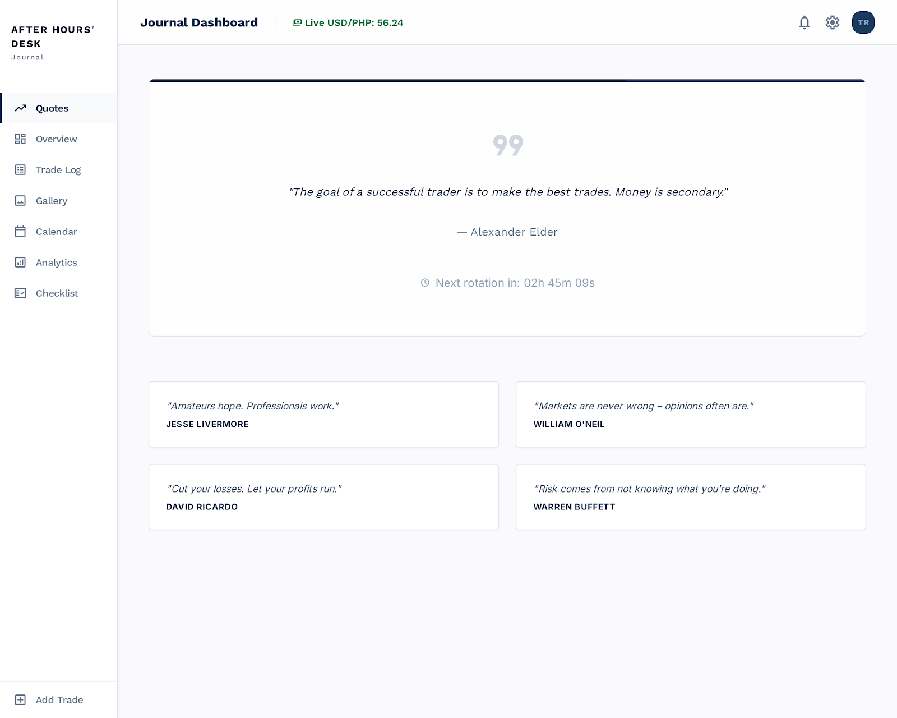

# After Hours Desk


A polished trading journal project built for the After Hours Desk workflow.

## Overview

This repository contains:

- `TradeLogPro.html` — the main standalone trading journal application
- `trading-journal-react/` — the React + Vite version of the application
- `stitch_after_hours_trading_journal/` — supporting page and component assets for the journal UI

## Features

- Landing page with features overview
- Dashboard with real-time USD/PHP conversion and metrics
- Trade log and performance analytics with charts
- Trade gallery and calendar review
- Pre-session checklist and journaling workflow
- Execution quality rubric for trade scoring
- Responsive design and polished UI



## Quick Start

### Standalone Version
Open `TradeLogPro.html` directly in a browser for a full-featured offline-capable trading journal.

### React Version
```bash
cd trading-journal-react
npm install
npm run dev
```

## GitHub Pages Preview

Enable GitHub Pages in your repository settings using the `main` branch and `root` directory. Once enabled, your app will be available at:

https://antonettegadrinab-cloud.github.io/After-Hours-Desk/

## License

This project is licensed under the MIT License. See [LICENSE](LICENSE) for details.
